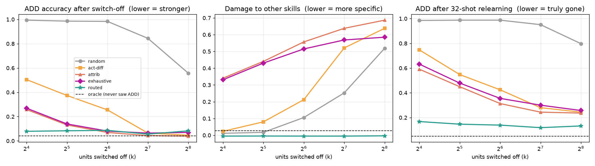

# Optogenetics → mech interp: does a built-in switch beat a found one?

## The question

Optogenetics (2026 Nobel, Deisseroth / Hegemann / Nagel) wasn't a better way to *find*
neurons. It **installed a switch into a chosen cell type during development**, and then
flipped it.

Mech interp mostly works the other way round: train the model, then go looking for the
units responsible for a behavior (probes, attribution, SAEs) and ablate them.

**Hypothesis:** a control handle installed during training is more *specific*, more
*complete* and more *durable* than the best handle you can find afterwards.

## Setup (`opto.py`)

- A residual MLP with 2 × 512 hidden units, trained on four modular-arithmetic skills
  selected by a task token: **ADD** a+b, **SUB** a−b, **ADD2** a+2b, **SQ** a²+b² (mod 31).
- It trains on 80% of input pairs. Everything is scored on the held-out 20%, so these
  are learned algorithms, not memorised lookup tables (about 99% held-out accuracy).
- The target is to switch off **ADD**. SUB and ADD2 are its near neighbors, which makes
  them the hard test for collateral damage.

| Handle | How it's chosen | Analogy |
|---|---|---|
| `random` | k random units | control |
| `act-diff` | units most selectively active on ADD | electrode recording |
| `attrib` | attribution-patching estimate of the ablation effect, ADD minus others | standard interp |
| `exhaustive` | the true single-unit ablation effect, ADD minus others | best-case post-hoc |
| **`routed`** | k units picked at random **before training**. ADD data may update only those units; other data may not touch them, and trains with them randomly silenced (p = 0.5). | genetic targeting + opsin |
| `oracle` | ADD data removed from training entirely | gold standard |

**Metrics** (all on held-out pairs; 4 seeds):
- ADD accuracy after switch-off: lower means the switch removes more.
- Damage to the other skills: lower means the switch is more specific.
- ADD accuracy after 32-shot fine-tuning: lower means ADD is actually gone, not just
  suppressed.

## Results



Selected rows (mean of 4 seeds; full table in `results/table.md`):

| Handle | k | ADD after off ↓ | Damage to others ↓ | ADD after relearning ↓ |
|---|---|---|---|---|
| exhaustive (best post-hoc) | 16 | 0.27 | 0.33 | 0.63 |
| exhaustive | 64 | 0.08 | 0.52 | 0.36 |
| attrib | 256 | 0.04 | 0.69 | 0.24 |
| **routed** | **16** | **0.08** | **0.00** | **0.17** |
| **routed** | **128** | **0.06** | **0.00** | **0.12** |
| oracle (never saw ADD) | – | 0.04 | 0.03 | 0.05 |

**1. With full labels, the built-in switch wins clearly.** It removes ADD as completely as
the best post-hoc method, with **zero** collateral damage at every size. The post-hoc
methods can't separate ADD from SUB/ADD2: by the point they suppress ADD, they've cost
33–69 points on the other skills. ADD also stays mostly gone after relearning (0.12–0.17,
vs 0.24–0.63 post-hoc). It isn't quite at the oracle's 0.05, so some trace of ADD
survives outside the switched units.

**2. Installing the switch is free.** With the switch on, the routed model scores 1.00 on
every skill, slightly above the normal model's 0.99.

**3. What made it work.** Each ingredient was tested separately at k = 64:

| Variant | ADD after off | Damage to others |
|---|---|---|
| loose: other data may also update the ADD units | 0.05 | 0.57 |
| strict, no silencing | 0.05 | 0.48 |
| loose + silencing | 0.13 | 0.01 |
| **strict + silencing** | **0.09** | **0.00** |

Silencing is the ingredient that matters. Without it, the rest of the network learns to
*depend* on the ADD units, so removing them breaks the other skills. Neuroscience has the
same problem: silencing a cell type disrupts the downstream circuits that relied on its
normal activity.

**4. The catch: it needs every target example to be labeled** (`label_frac.py`). With
only part of the ADD data labeled:

| Labeled | Silencing | ADD after off | Others after off | ADD after relearning |
|---|---|---|---|---|
| 5–50% | 0.5 | 1.00 (switch does nothing) | 1.00 | ~0.98 |
| 25–50% | 0.1 | ~1.00 (switch does nothing) | 1.00 | 0.87–1.00 |
| 25–50% | 0 | 0.05 | 0.13–0.94 (heavy damage) | 0.23–0.77 |

Unlabeled ADD examples get treated as ordinary data. With silencing, they teach the rest
of the network to do ADD on its own, so switching off the ADD units does nothing. Without
silencing, the switch removes ADD but damages the other skills, the same failure as the
post-hoc methods. **With imperfect labels, the advantage disappears.**

## Takeaway

The optogenetics approach is a real advantage in this toy: a built-in switch is cleaner
and more durable than the best switch found afterwards. But it inherits optogenetics' own
prerequisite. You must be able to tag the target "cell type" reliably during development.
In neuroscience that tag is a genetic promoter. In AI it's a label on the training data,
and real data won't be fully labeled.

So the open problem is not "build a better switch". It's **installing a switch from
imperfect labels**.

## Where to look next

1. **Activity-dependent tagging.** Neuroscience has an answer to "we can't label every
   cell": methods like TRAP and engram tagging label whichever cells were *active during
   an experience*. The AI version: use the switch units' own activity to find unlabeled
   target examples during training, then route those too. Testing this needs a task
   where labels aren't trivially recoverable, unlike this toy, where the task token gives
   them away.
2. **Make silencing label-robust.** Silencing only on examples confidently judged
   non-target, or a schedule that starts strict and relaxes.
3. **Scale.** Repeat on a small transformer language model with a natural target (one
   language, one domain), with partial and noisy labels. Compare against an SAE-feature
   ablation baseline, then test the switch-on direction too (does activating the units
   induce the behavior?).
4. **Adversarial durability.** Larger fine-tuning budgets, and attacks that try to
   reroute ADD around the switched-off units.

## Caveats

- This is a toy: one small MLP, synthetic tasks, and a 31-number modular-arithmetic space.
- Post-hoc handles here are individual units. SAE features, which can be more
  monosemantic, were not tested.
- Gradient routing is existing work (Cloud et al., 2024). What's new here is the
  head-to-head comparison against post-hoc handles, the separate test of each ingredient,
  and the partial-label failure analysis.

## Reproduce

```
pip install torch numpy matplotlib
for s in 0 1 2 3; do python opto.py --seed $s --out results/seed$s.json & done; wait
python analyze.py
for s in 0 1 2 3; do python label_frac.py --seed $s --out results/labelfrac_seed$s.json & done
```
On 4 CPU cores this takes about 40 minutes.
